# How to Use the HydroServer Streaming Data Loader

This guide explains how to use the **HydroServer Streaming Data Loader** to upload data from a CSV file into HydroServer.

The Streaming Data Loader is a desktop application that helps move time-series data, such as discharge, streamflow, temperature, or sensor data, from a CSV file on your computer into a HydroServer datastream.

Before using the Streaming Data Loader, make sure you already have:

- A HydroServer workspace
- A site created in HydroServer
- A datastream created for the data you want to upload

---

## 1. Download and Install the Streaming Data Loader

Go to the Streaming Data Loader release page: https://github.com/hydroserver2/streaming-data-loader/releases


Download the correct installer for your operating system:
- Windows
- macOS
- Linux

After downloading the file, open it and follow the installation instructions.

---
## 2. If Windows Shows a Warning

On Windows, you may see a warning message that says:

> Windows protected your PC

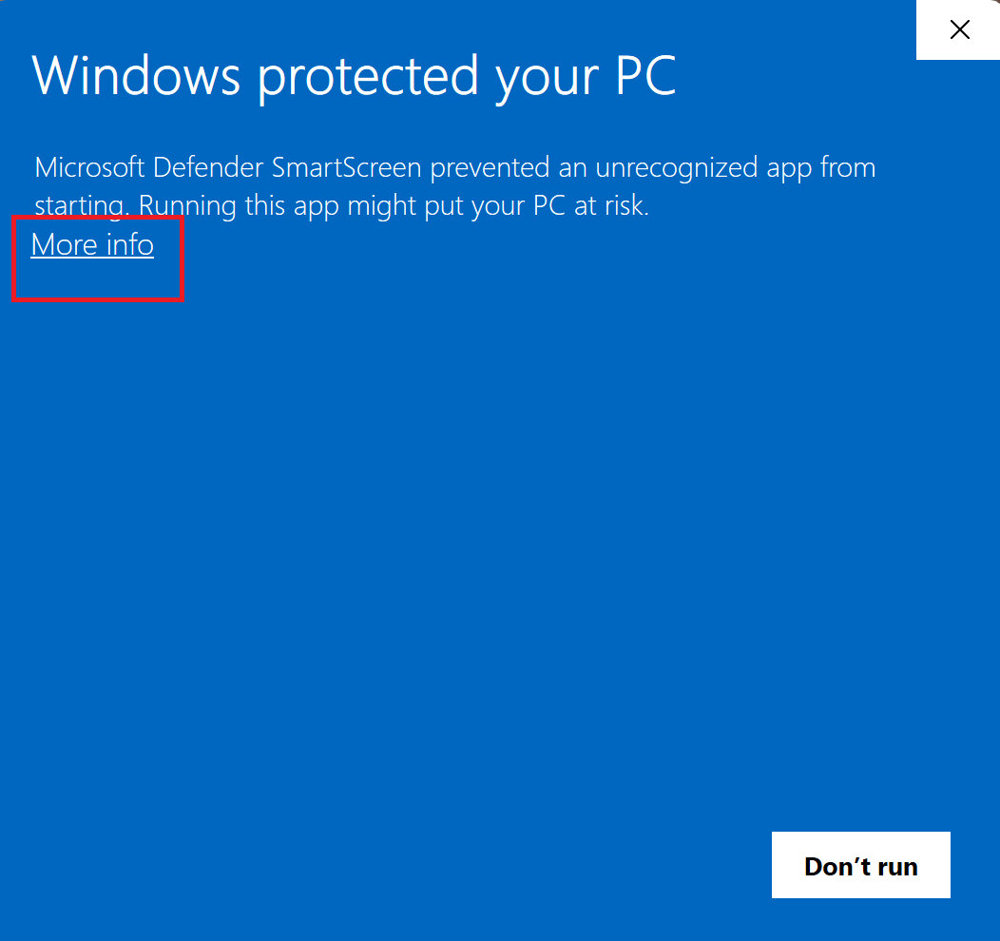

If this happens:

1. Click **More info**.
2. Click **Run anyway**.

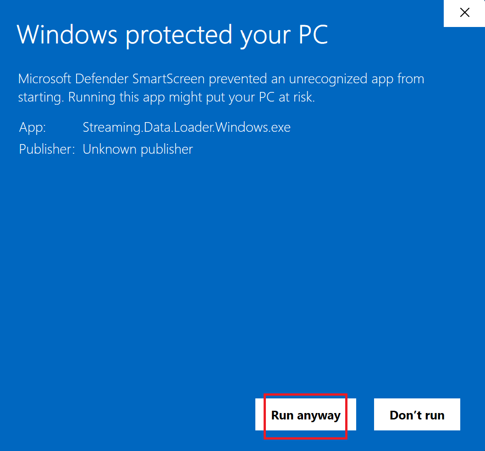

3. Continue installing the application.

After installation, you can right-click the app and choose **Pin to Taskbar** if you want to open it more easily later.

---
## 3. Install the Background Process

After the Streaming Data Loader is installed, open the application. The app may ask you to install a background process.

Click:
**Install Background Service**

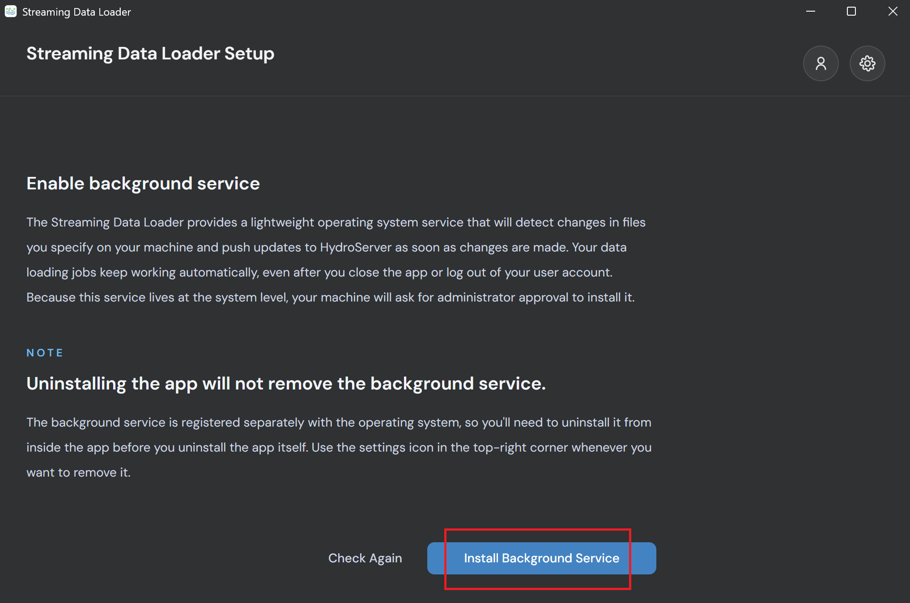

The background process allows the Streaming Data Loader to keep checking your CSV file and automatically upload new rows when they are added.

---

## 4. Connect the App to HydroServer

Before uploading data, you need to connect the Streaming Data Loader to HydroServer.

You can connect by using either:

- Your HydroServer username and password
- An API key


Using an **API key** is recommended because it gives the app only the permissions it needs to upload data.

You will need:
- The HydroServer website address
- An API key

Example HydroServer address:

```text
https://playground.hydroserver.org
```

Paste the website address into the **Host URL** box. Then paste your API key into the **API Key** box. Click: **Connect to HydroServer**

---

## 5. Create an API Key in HydroServer

An API key works like a secure password that allows the Streaming Data Loader to upload data to your HydroServer workspace.

To create an API key:
1. Open the HydroServer website.
2. Go to **Your sites**.
3. Click **Manage workspaces**.
4. Find your workspace in the table.
5. Click the lock icon.

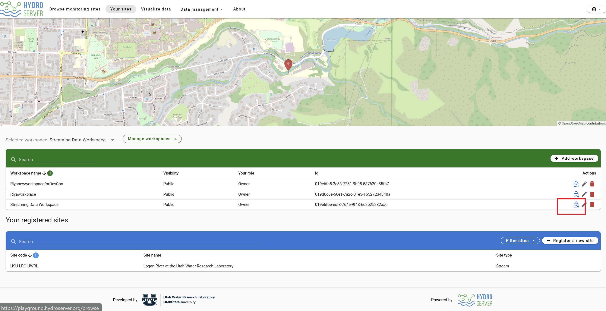

6. Click **API keys**.
7. Click **Create API key**.
8. Give the API key a name.
9. Add a short description.
10. Select the role as **Data Loader**.

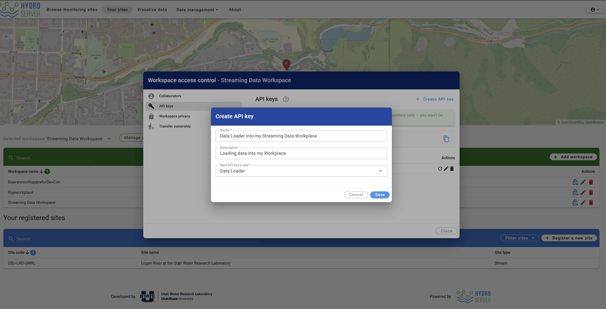

11. Click **Save**.
12. Copy the API key.

Save the API key somewhere safe. After you close the window, HydroServer may not show the same key again.

If you lose the key, you can create a new one.

---

## 6. Prepare the CSV File

Before selecting the CSV file, make sure the file is saved in a location that the Streaming Data Loader can access. A good folder location is important because the loader may run as a background service.

Good places to store the CSV file include:

### Windows

```text
C:\CampbellSci\LoggerNet\
```

or

```text
C:\ProgramData\sdl\data\
```

### macOS

```text
/Users/Shared/LoggerNet/
```

### Linux

```text
/var/loggernet/
```
<div style="
  background-color: #fff3f3;
  border-left: 6px solid #ff4d4d;
  padding: 14px 18px;
  margin: 20px 0;
  border-radius: 6px;
  color: #000000;
  width: fit-content;
  max-width: 600px;
">

<h3 style="color: #000000; margin-top: 0;">⚠️ Avoid These File Locations</h3>

<p style="color: #000000;">
Do <strong>NOT</strong> save your CSV file in:
</p>
<ul style="color: #000000;">
  <li>Desktop</li>
  <li>Downloads</li>
  <li>Documents</li>
  <li>Temporary folders</li>
  <li>Program Files</li>
  <li>Cloud folders such as OneDrive, Dropbox, or Google Drive</li>
</ul>

<p style="color: #000000; margin-bottom: 0;">
These locations may cause <strong>permission issues</strong> or make it harder for the Streaming Data Loader to detect file updates correctly.
</p>

</div>

---

## 7. Choose the CSV File

In the Streaming Data Loader, click: **Choose CSV File**


Then select the CSV file from your computer. A typical CSV file may look like this:

```csv
timestamp,max_temp_c,min_temp_c
2025-03-23T00:00:00Z,11.7,-1.5
2025-03-24T00:00:00Z,8.4,-2.0
2025-03-25T00:00:00Z,10.9,-2.2
```

Your CSV file should usually include:

- A timestamp column
- One or more data value columns
- Optional quality-control columns, if needed

For example, if you are uploading discharge data, your CSV file should include a timestamp column and a discharge value column.

---

## 8. Set Up the CSV File

After selecting the CSV file, the app will show a setup page. This page tells the Streaming Data Loader how to read your CSV file. Check each of the following settings carefully.


### Delimiter

The delimiter is the symbol that separates the columns in the file.

For most CSV files, choose:
```text
Comma
```
Other possible options include: Semicolon, Tab, Pipe or Space

### Column Identifiers

If your CSV file has column names, choose: **Header names**.
This allows the app to use the names at the top of the table.

### Header Row

The header row is the row where the column names start. Move/Drag the **HEADER** marker to the row where the column names are located.

### Data Start Row

The data start row is the first row where the actual data begins. Move/Drag the **DATA START** marker to the first row of real data.

### Timestamp Column

Choose the column that contains the date and time.

### Timestamp Format

Choose the timestamp format that matches your CSV file. If the timestamp format is different, choose the closest option or use a custom format. 

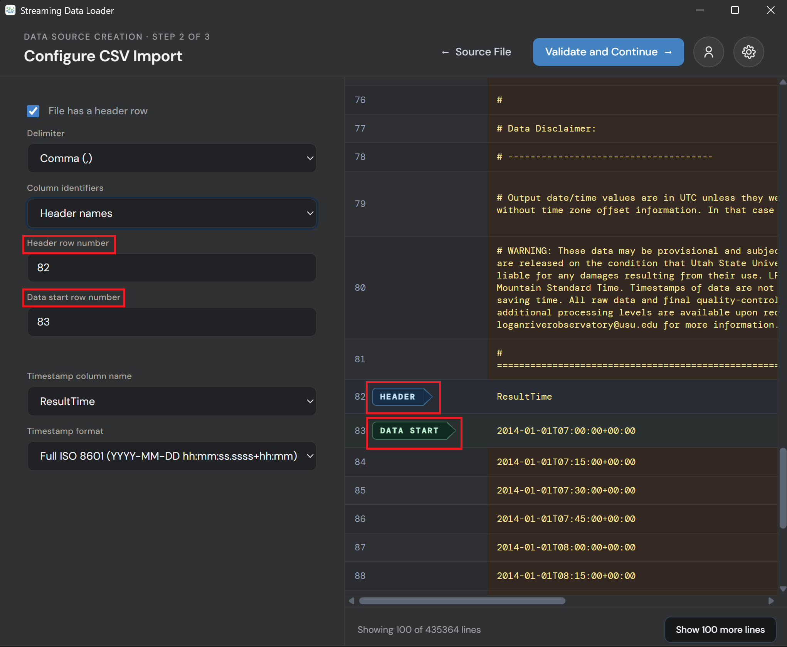

When everything looks correct, click:
**Validate and Continue**

---

## 9. Match CSV Columns to HydroServer Datastreams

After the CSV file is validated, the app will show a mapping page. This step connects the columns in your CSV file to the correct HydroServer datastreams.


You need to select:
1. The CSV column that contains the data values
2. The correct HydroServer site
3. The correct HydroServer datastream


Example:
- CSV column: `max_temp_c`
- Site: `Logan River at the Utah Water Research Laboratory`
- Datastream: `Temperature`

If you are uploading discharge data, the setup may look like this:

- CSV column: `Discharge`
- Site: `Logan River at the Utah Water Research Laboratory`
- Datastream: `Discharge`

Make sure the CSV column matches the correct datastream.
For example, do not connect temperature data to a discharge datastream.

---

## 10. Create the Data Source

After selecting the correct CSV column, site, and datastream, click: **Create**

This creates the data source and starts the upload process. After this, the Streaming Data Loader will begin sending the CSV data to HydroServer.

---

## 11. Check the Upload Status

After clicking **Create**, the app will take you to the dashboard. The dashboard shows the data sources you have created.
If the status says:
```text
Running
```

the data is still being uploaded.

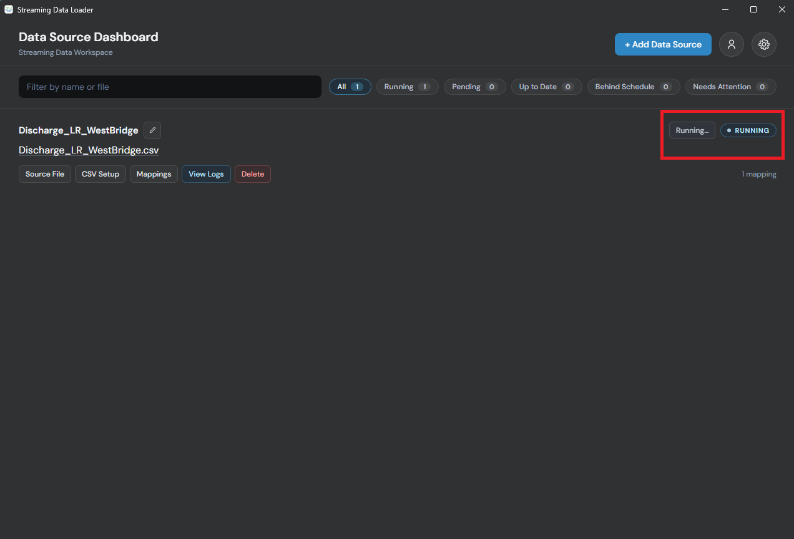

You can click: **View Logs** to check whether the upload is working correctly. If something is wrong, the logs usually show a message explaining what needs to be fixed.

---

## 12. Check the Data in HydroServer

While the Streaming Data Loader is uploading the data, open HydroServer in your browser. Go to your workspace and refresh the page.
If the upload is working, the number of observations in the datastream should **increase**. This means the data is being loaded successfully.

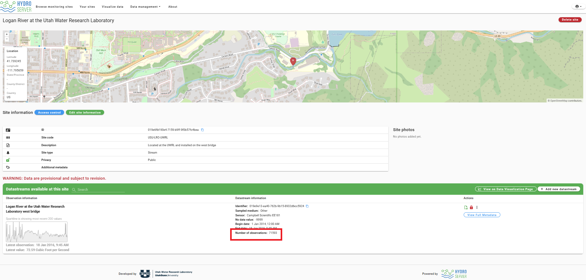
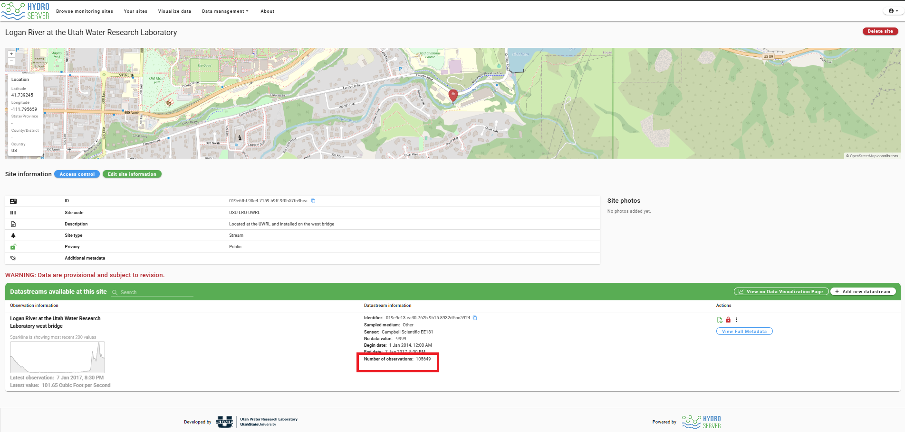

---

## 13. When the Upload Is Finished

When the upload is complete, the Streaming Data Loader will show:

```text
UP TO DATE
```
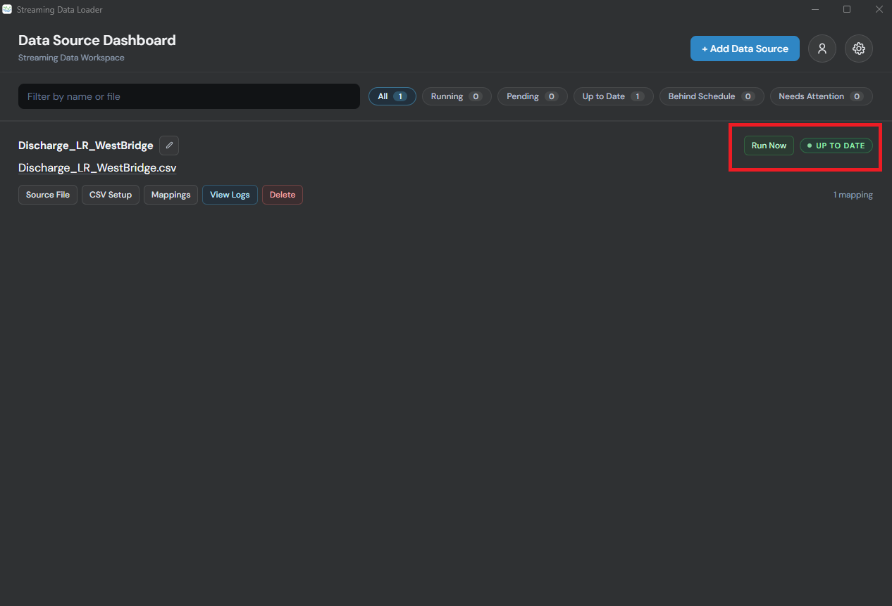

This means the CSV file has been uploaded to HydroServer. If new rows are added to the CSV file later, the Streaming Data Loader can detect them and upload the new data automatically.

---

## 14. Visualize the Data in HydroServer

After the data is uploaded, you can view it in HydroServer.

To visualize the data:

1. Open the HydroServer website.
2. Go to the data visualization page.
3. Use the workspace filter to find your workspace.
4. Select your datastream from the datastream table.
5. View the uploaded data as a time-series plot.


You should now be able to see your uploaded data in HydroServer.

---

## 15. Change the Workspace or API Key

If you need to upload the data in a different workspace:

1. Open the Streaming Data Loader.
2. Click the account icon.
3. Choose the API key option.
4. Enter the new API key.
5. Reconnect to HydroServer.

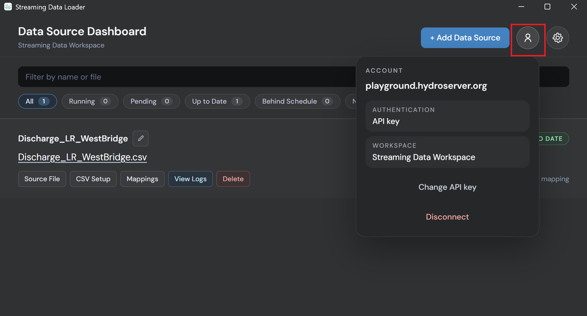
---
