# User Guide: HydroServer Quality Control App

This guide is for the operator: the hydrologist or technician who picks
a datastream, marks the bad points, and submits the cleaned series back
to HydroServer. It walks through every feature on the screen and the
shortest path to common QC tasks.

If you are looking for developer / deployment docs, start with
[ARCHITECTURE.md](./ARCHITECTURE.md) instead.

## What this app does

The QC App is the operator's view of HydroServer's quality control
pipeline. With it you can:

1. **Browse** sites and datastreams in a HydroServer workspace.
2. **Plot up to five datastreams** on a synchronized multi-axis chart
   for visual context.
3. **Pick one datastream as the QC target.** The rest are read-only
   reference traces.
4. **Filter** suspicious points using value thresholds, time windows,
   change detection, rate-of-change limits, gap detection, or
   persistence runs.
5. **Edit** the selected points: change values, interpolate, drift-
   correct, shift datetimes, delete, fill gaps, add points, attach
   qualifier flags.
6. **Save your edits as a QC script** (a JSON file you can replay on
   the same or another datastream later).
7. **Submit** the cleaned observations back to HydroServer.

Everything runs in your browser. The backend never sees your edit
history until you press Save.

## Glossary

| Term | Meaning |
|------|---------|
| **Workspace** | A HydroServer scope (one organization or project's data). You pick one when you sign in. |
| **Thing / Site** | A physical site or sampling location. |
| **Datastream** | A single time-series at a site: one variable, one sensor, one processing level. |
| **Observation** | A single (timestamp, value) measurement. |
| **QC target** | The datastream you are editing. There is always exactly one QC target when the Edit view is open. |
| **Context traces** | The other plotted datastreams. Visible but read-only. They exist to give you context for the QC target. |
| **History** | The ordered list of filters + edits you've applied in the current session. Undo / redo / save / load all operate on this list. |
| **Selection** | The set of point indices a filter (or your click / lasso) produced. Edits operate on the current selection. |
| **QC script** | A JSON file holding your history. Reusable across datastreams; the canonical save format. |
| **Submit / Save** | POST the cleaned observations back to HydroServer with `mode=replace`. This overwrites the existing observations in the window you have plotted. |

## First-time setup

1. Open the app URL. You'll be redirected to the **Log in** page.
2. Enter your HydroServer email and password, then press **Log in**.
   If your deployment has Google OAuth wired up an extra "Sign in with
   Google" button appears below the form.

   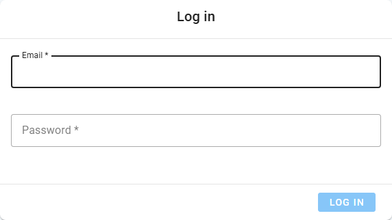

3. On the **Workspaces** page, pick the workspace you want to work in.
   The choice is remembered locally, so next time you sign in you'll
   land directly on Home.

   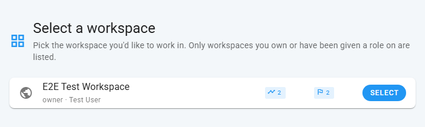

4. On **Home**, the left filter drawer is open. Pick a time range and
   filter the datastream list by site / observed property / processing
   level. Click a row to plot it.

If the screen ever stays blank with a console error like `Failed to
fetch app settings`, ask your administrator to check the API URL and
COOP/COEP configuration ([DEPLOYMENT.md](./DEPLOYMENT.md) covers this).

## The screen, top to bottom

The two main views are **Select** (browse + preview) and **Edit** (the
QC workbench). The narrow icon column on the far left (the navigation
rail) switches between them.

### Navigation rail

A thin, always-visible column of icons.

| Icon | Action |
|------|--------|
| HydroServer logo | Go home. Resets the current view. Prompts before discarding unsaved edits. |
| Cursor (Select) | Show the Select drawer + plot. |
| Pencil (Edit) | Open the Edit view. **Disabled** until you've picked a QC datastream; the tooltip explains why. |
| Stopwatch (Performance) | Open the Performance Calibration dialog. See "Performance" below. |
| Grid (Workspace) | Switch workspace. |
| Logout | Sign out. |

If you click any of these while you have unsaved edits in the Edit
view, the app shows an "Unsaved edits" dialog with **Save &
continue** / **Discard** / **Cancel**. Discarded edits cannot be
recovered.

### Select view

The default landing surface after picking a workspace. The left filter
drawer is **collapsible** via the chevron at its top and **resizable**
by dragging its right edge.

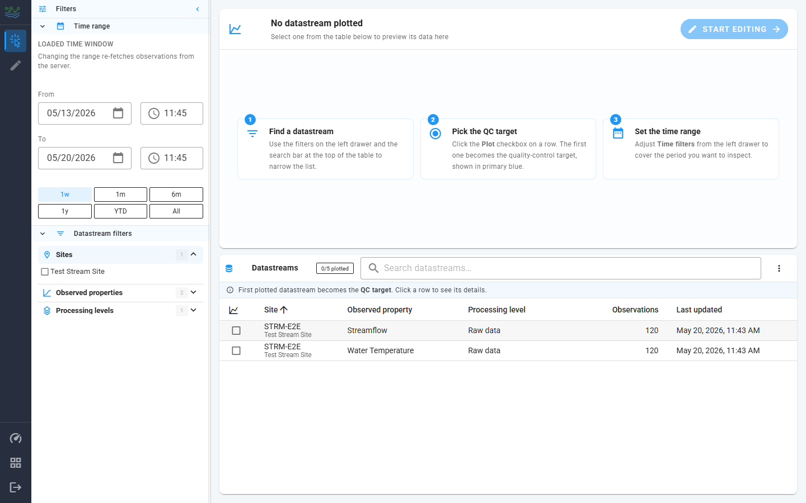

The drawer has two collapsible sections:

- **Time range**: the loaded time window. The two date pickers (`From`
  / `To`) are the source of truth; below them is a row of preset chips:
  **1w**, **1m**, **6m**, **1y**, **YTD**, **All**. Picking a preset
  re-fetches observations from the server. A `Custom` chip appears
  when the dates were edited manually.

  > **Tip:** when previewing a brand-new datastream whose observations
  > might be years old, click **All** first. The default `1w` preset
  > can show an empty window for old data and make the plot look
  > broken.

- **Datastream filters**: pick the site, observed property, and
  processing level. The list of matching datastreams updates live.

The main area is split top/bottom:

- **Top card** carries the preview plot, the current QC target's name
  (or "No datastream plotted"), and the **Start editing** button that
  jumps to the Edit view. The right pane of the card lists currently
  plotted datastreams.
- **Bottom card** is the **Datastreams table**: every datastream the
  filters match. Each row has a plot toggle; the first datastream you
  toggle on becomes the QC target (radio button column).

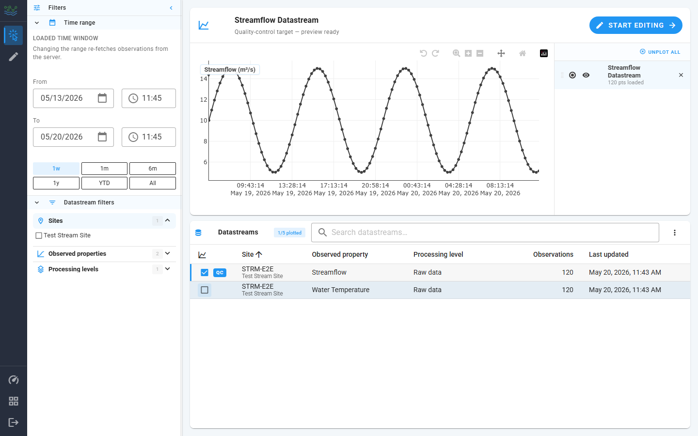

Clicking a datastream row plots it. The first datastream becomes the
**QC target**. You can change the QC target via the radio column on
the table or by reordering the Plotted Datastreams list.

### Edit view

Opens when you click the pencil icon in the nav rail, or the **Start
editing** button on the Select view. Available only after you've
picked a QC datastream.

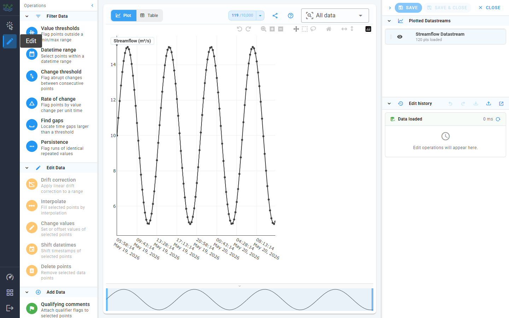

Three columns, each independently resizable / collapsible:

| Column | Contents |
|--------|----------|
| **Left** ("Operations") | The Edit drawer with three sections: Filter Data, Edit Data, Add Data. |
| **Center** | The Plotly chart + a tab-switched data table for the QC target. |
| **Right** ("Aux") | At the top: **Save** / **Save & Close** / **Close** actions. Below that: Plotted Datastreams, Edit history, and the currently staged Operation Panel. |

The chart at the top of the center column has a Plotly toolbar with:

- **Zoom** (drag a horizontal box on the x-axis)
- **Pan** (hold + drag)
- **Box select / Lasso select**: the primary way to select points for
  an edit.
- **Reset axes**: back to the full plotted window.

Clicking a single point selects just that point. Clicking the empty
plot area clears the selection.

### Plotted datastreams list

The right-hand list (visible on both Select and Edit views) is the
roster of currently plotted datastreams. Each row carries:

- A drag handle to reorder the list (drag the QC target's row to
  promote / demote it; the line colors track the order).
- A colored radio dot that picks the **QC target**. The active row is
  tinted; the other rows render in their reference colour.
- An **eye** toggle that hides the trace from the plot without
  unplotting it. Hidden rows render with a strikethrough.
- A **Y-axis** toggle (non-QC rows only) that collapses that
  datastream's secondary axis.
- The datastream name and a subtitle showing the number of points
  loaded **in the current time window**, e.g. `1,248 pts loaded`.
  While the fetch is still in flight the subtitle reads `loading…`.
- An `×` button to unplot the row.

If a plotted datastream has no observations in the current window
(either because the dataset is empty there or because the chosen time
range doesn't cover its data), the row title shows a small
warning-tinted database icon. Hover it for the tooltip "No
observations in the current time window". Widening the time range
(or clicking **All** in the Time range section) usually clears it.

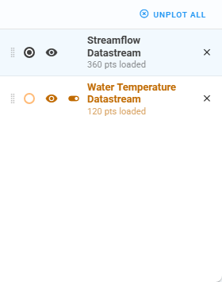

### Plotting multiple datastreams

You can plot up to **5 datastreams at a time**. The plotted count and
cap are surfaced in the Datastreams table toolbar as a chip
("`N/5 plotted`"); once you hit the cap the unchecked rows disable
their plot toggles and a tooltip explains why. Unplot a row from
either the table or the list to free up a slot.

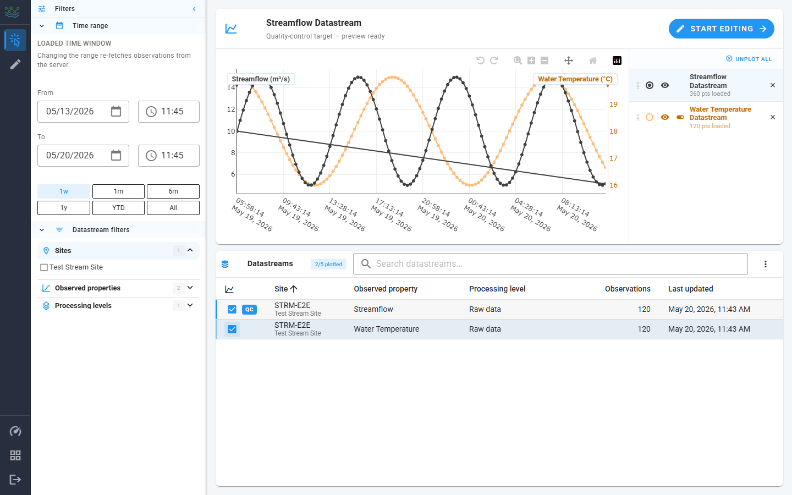

When more than one datastream is on the plot:

- The **first** datastream you plot becomes the **QC target** and
  uses the primary (left) Y axis. Its line draws in black with a
  point marker on every observation.
- Each additional datastream gets its **own Y axis** on the right
  side of the plot. The chip at the top of each axis carries the
  datastream's display name plus its unit (e.g. `Water Temperature
  (°C)`). Up to four secondary axes stack side by side.
- Axis chips are colored to match their line so you can tell at a
  glance which trace goes with which axis.

Once a datastream is on the plot, the **plotted datastreams list**
on the right is where you manage it (see the previous section for
the row anatomy). The interactions most relevant to multi-series
work:

- **QC target picker**: clicking the colored radio dot on a non-QC
  row promotes that datastream to the QC target. The primary Y axis
  rebinds to its scale and the previous QC datastream demotes to a
  secondary axis. The Edit view shows only the QC target's points
  for selection; context traces are read-only.
- **Eye toggle**: hide / show a trace on the plot without unplotting
  it. Useful when one series is visually crowding the others. Hidden
  rows render with a strikethrough; their axis stays on the plot so
  the scale doesn't jump.
- **Y-axis toggle** (non-QC rows only): collapse just the secondary
  axis without removing the trace. Reach for it when the extra axes
  start eating horizontal room and you don't actually need the
  numeric scale.
- **Drag handle**: drag a row up or down to reorder the legend. The
  plot redraws so the trace colors track the new order.
- **× button**: unplot the row entirely. Removing the QC target
  promotes the next plotted row to QC.

### Pan and zoom across axes

The Plotly toolbar at the top of the chart drives the X-axis
gestures (Zoom, Pan, Reset). For Y axes the gestures are slightly
different and worth knowing about when you're juggling several
datastreams:

- **X-axis zoom**: drag a horizontal box on the time grid (Zoom
  tool), or scroll over the plot. Every axis stays time-synchronised.
- **X-axis pan**: enable Pan in the toolbar, then drag the plot
  body. The context plot at the bottom is also draggable; it acts
  as an overview thumbnail.
- **Per-axis Y zoom**: hover near the ends of any Y axis and drag.
  Only that axis rescales; sibling axes keep their current view.
  This is how you "compare units": drop the temperature axis to a
  tight window without touching streamflow.
- **Per-axis Y pan**: hover the middle of a Y axis and drag.
- **Reset**: the home icon on the Plotly toolbar returns to the
  default zoom (does not change the begin/end dates in the
  sidebar).
- **Fit Y to visible**: the vertical-collapse icon in the toolbar
  rescales every Y axis to the currently visible X window. Handy
  after a deep zoom when one trace ends up off-axis.

The `?` (help) menu in the plot toolbar carries a "Plot tips" card
listing the hidden gestures (per-axis pan/zoom, scroll-to-zoom,
crosshair, overview strip) and the keyboard shortcuts (`Ctrl+Z`
undo, `Ctrl+Y` redo). Toolbar icons aren't listed there because
each one already shows its name on hover.

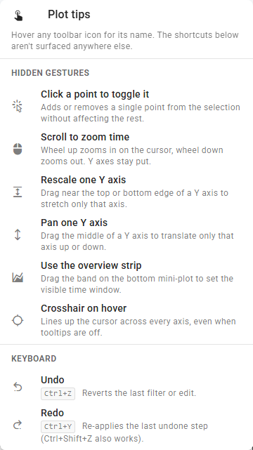

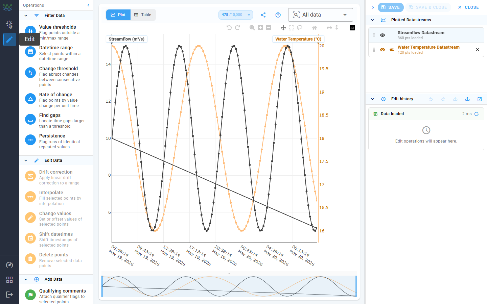

### Edit drawer (left)

The drawer is a vertical column of operation rows, grouped into three
collapsible sections that share the same chevron + tinted-header
treatment as the Select drawer.

| Group | Tint | Purpose |
|-------|------|---------|
| **Filter Data** | Blue | Flag points without changing values. The result is a selection on the plot. |
| **Edit Data** | Blue (or amber for "needs selection") | Change values or timestamps at the current selection. Amber rows disable themselves until you make a selection. |
| **Add Data** | Green | Insert new points (Add Points, Fill Gaps) or attach qualifiers without changing values. |

Click a row to open its panel on the right; click the same row again
to dismiss it.

## The QC operations, panel by panel

Every panel opens in the right column with the same header layout: an
icon-colored avatar, the title and one-line description, and an `×`
button to close. All panels list the **current selection size** at the
top (when relevant). All commit buttons live in the panel footer.

### Date range mask

Every filter panel (except **Datetime range**, which already owns its
own picker) opens with a collapsed **Date range mask** section at the
top. By default the filter scans the full datastream. Click **Enable
date range mask** to constrain it to a datetime window.

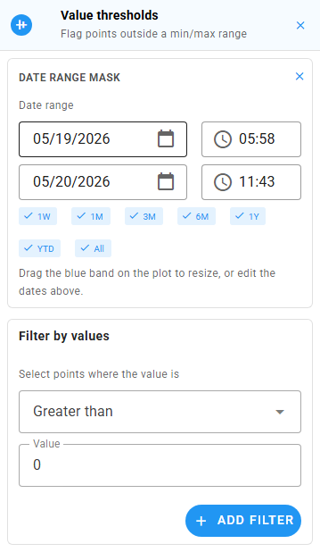

When enabled, the section exposes:

- Two date/time pickers (`From` / `To`); these are the source of
  truth.
- Preset chips (**1W**, **1M**, **3M**, **6M**, **1Y**, **YTD**,
  **All**) that snap the pickers to a common window relative to the
  loaded data.
- A draggable blue band overlaid on the plot. Resize it by dragging
  either edge, or move it whole by dragging its middle. The pickers
  and the band stay in sync.

Run the filter as usual (value thresholds, change threshold, rate of
change, find gaps, persistence) and only points inside the window
are considered. Filters whose result is a selection (Find gaps,
Datetime range) honour the mask too. The `×` icon in the section
header disables the mask and reverts to "full datastream" scanning;
closing the operation panel also clears the mask.

Use the mask when you want to QC a specific event window without
touching the rest of the series: e.g. flag persistence runs only
inside a known outage, or apply a value threshold only to last
month's data.

### Filter operations

These do not change data. They produce a selection that the next edit
operation acts on.

#### Value thresholds

Flag any point whose value satisfies a chosen comparator (`>=`, `>`,
`==`, `<`, `<=`). Combine multiple comparators; each appears as a
removable chip under "Applied".

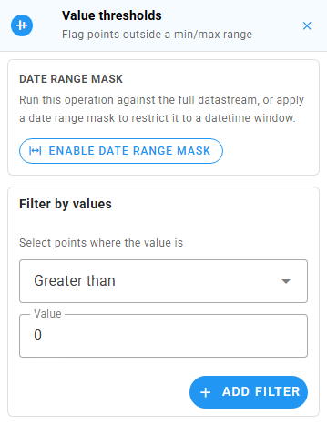

Typing a number and pressing Enter (or clicking **Add filter**) runs
the filter; the selection on the plot updates live. Use **Clear all**
on the applied chips row to remove every comparator at once.

> **Example:** "Anything reading > 100 mg/L is bad" → set
> `Greater than: 100` and run. Every offending point is now selected.

#### Datetime range

Select every point inside a datetime window. The panel uses the
shared range stager: two date/time pickers, a row of presets, and a
draggable band overlaid on the plot.

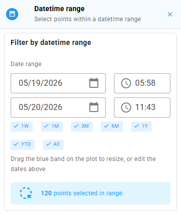

The selection updates live as you drag the band or edit the dates;
there's no commit button. The alert at the bottom shows the running
count of points caught.

#### Change threshold

Flag pairs of adjacent points whose value delta satisfies a chosen
comparator. Catches sudden spikes / drops that violate physical
plausibility.

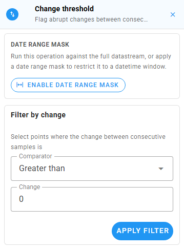

Pick a comparator from the dropdown, type the delta, and click
**Apply filter** (or press Enter on the value field).

#### Rate of change

Like Change, but normalized to value change per unit time and
expressed as a **percent**. A `>= 50 %` threshold flags points whose
fractional change is at least one half of their neighbor's value.

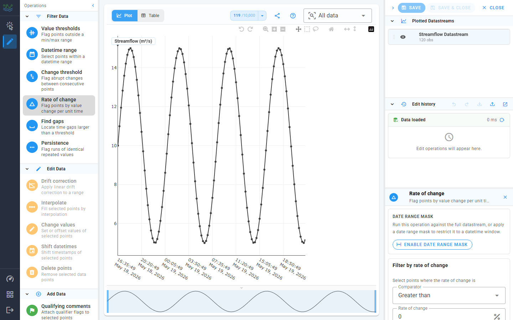

#### Find gaps

Locate gaps in time between consecutive observations that exceed a
threshold. The panel uses the shared gap finder: a date-range stager,
threshold with units, snap chips (when the datastream declares an
intended cadence), and red bands overlaid on the plot. The endpoints
of every detected gap are selected on the plot; there's no commit
button.

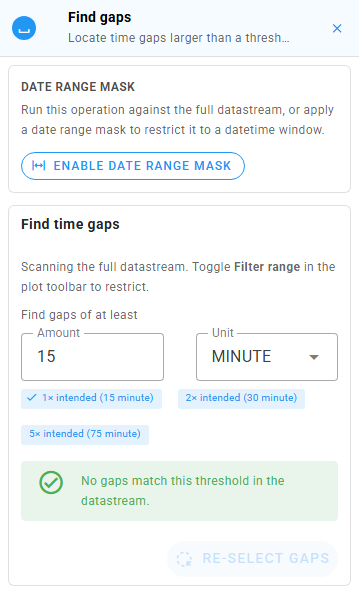

The **Re-select gaps** button at the bottom re-applies the current gap
endpoints to the plot. Useful when a box-select or lasso has wiped
the visible selection.

#### Persistence

Flag runs of identical repeated values (e.g. the sensor stuck on the
same reading for 30 minutes). Set the minimum run length with the
"times in a row" stepper and click **Apply filter**.

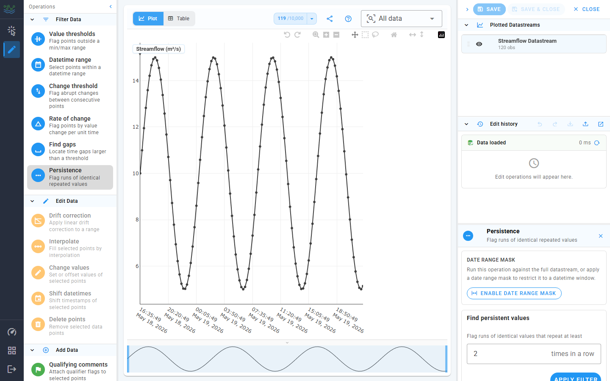

### Edit operations

These change values or timestamps at the current selection. The drawer
disables them (amber row) until you make a selection. The panel shows
an "empty state" with a hint if you open it with no selection active.

#### Drift correction

Apply a linear drift correction across each consecutive group in the
selection. Use this when a sensor has drifted from a known reference.

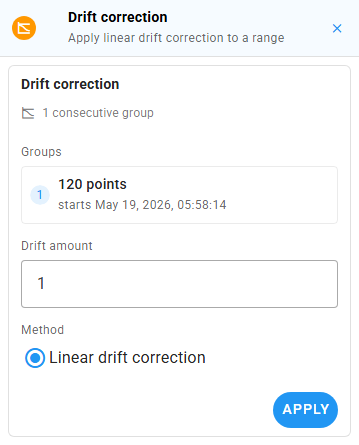

The panel lists every consecutive group it found in your selection,
each with its first-point timestamp. **Drift amount** is the offset to
apply linearly from the start to the end of each group. The radio at
the bottom selects the method (today the only option is "Linear drift
correction"). Drift correction needs **two or more consecutive
points**; the Apply button stays disabled until that's true.

#### Interpolate

Replace each consecutive group in the selection with linearly
interpolated values from the surrounding good points.

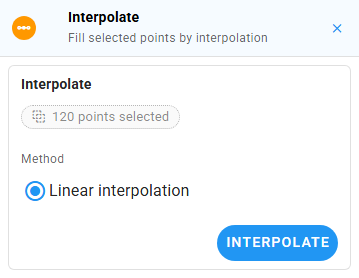

#### Change values

Apply an arithmetic operator at each selected index. The toggle row
is `+ − × ÷ =`. The label below the toggle reminds you of the
operation: `New value = old <op> input`.

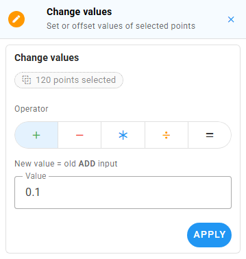

Press Enter on the value field, or click **Apply**, to commit.

#### Shift datetimes

Offset the selection's timestamps by a duration. Pick an amount and a
unit. Useful when a sensor's clock was off.

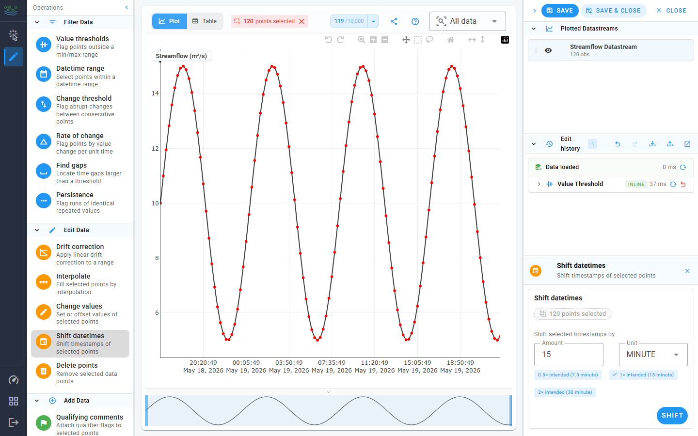

When the QC datastream declares an `intendedTimeSpacing`, the panel
shows snap chips (`0.5×`, `1×`, `2×`) that pre-fill the amount with
a multiple of the intended cadence. The active chip gets a check
mark.

#### Delete points

Drop the selected points from the series entirely. The warning
banner repeats the count of points about to disappear; the destructive
red Delete button is the only commit affordance.

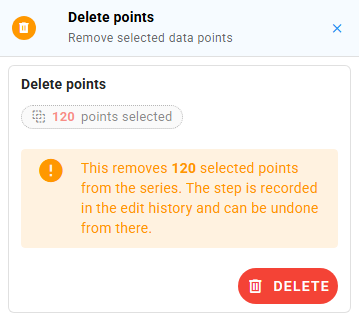

The deletion is recorded in history and can be undone from there.

### Add operations

#### Qualifying comments

Attach qualifier flags (e.g. "Approved", "Borderline") to the selected
points. Pick one or more qualifiers from the autocomplete; existing
qualifiers already applied to the selection are listed below in chip
form.

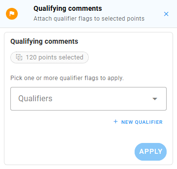

The **New qualifier** button opens a small dialog where you can
register a new code + description against the workspace.

> **Note:** qualifier codes are tracked locally and are POSTed to the
> workspace's qualifier list, but the per-point qualifier applications
> themselves are not yet serialized to the backend on Save. See
> [QUALITY.md](./QUALITY.md) for the status.

#### Add points

Insert one or more `(datetime, value)` tuples. Each row is a card
with a datetime picker and a value field. **+ Row** appends another
row, the `×` icon removes one.

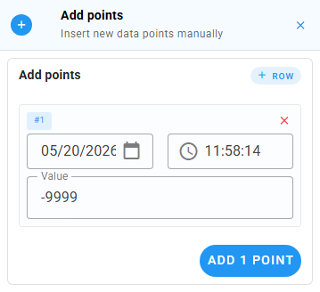

The first row is seeded with the last selected point's timestamp (or
the last observation in the series) plus the datastream's intended
cadence, so a quick "extend the series by one point" workflow is one
click + one number. Subsequent rows auto-increment by the same
cadence.

#### Fill gaps

Detect gaps over a threshold and fill them with interpolated values
or a constant NoData value at a chosen cadence.

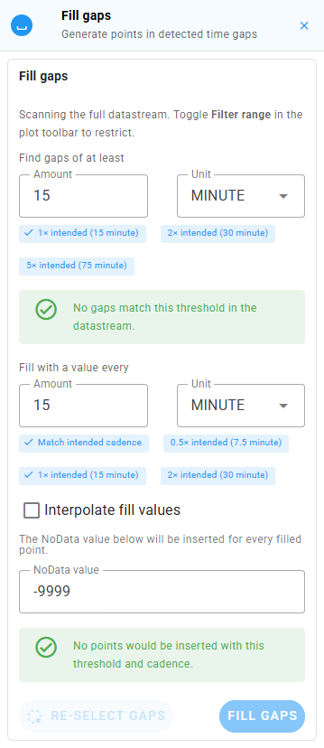

The panel reuses the Find-gaps finder at the top (date range,
threshold, snap chips, plot-overlay bands), then adds:

- **Fill with a value every &lt;amount&gt; &lt;unit&gt;**: the
  insertion cadence. A **Match intended cadence** chip is shown when
  the datastream declares one; `0.5×`, `1×`, `2×` snap chips fine-tune
  from there.
- **Interpolate fill values** checkbox: when on, inserted values are
  linearly interpolated between the gap endpoints. When off, the
  panel reveals a **NoData value** field that's used for every
  inserted point.
- A live status row at the bottom reports how many gaps were found
  and how many points the current cadence would insert.
- Ghost-marker preview points on the plot for every planned insertion.

Cadence warnings appear when the fill step would skip gaps just above
the threshold, or when the cadence doesn't divide evenly into the
datastream's intended spacing. The **Re-select gaps** button mirrors
the one in Find gaps.

> **Workflow:** if you only want to see the gaps without filling them,
> use Find gaps instead. Fill gaps is the same finder with the fill
> controls bolted on.

## The Edit history panel

Every filter, edit, and add operation appends a row to **Edit
history** in the right sidebar.

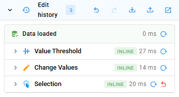

The header carries the count chip and four icon buttons (left to
right): **undo**, **redo**, **save QC script** (tray-arrow-down),
**load QC script** (tray-arrow-up), and **open in window** (the
pop-out icon, which reopens the same panel inside a modal). Keyboard
shortcuts: `Ctrl+Z` to undo, `Ctrl+Y` or `Ctrl+Shift+Z` to redo.

The body shows:

- A baseline **Data loaded** row at the top, with a reload-from-server
  button.
- One row per history entry, each with:
  - The operation icon and Title-Case name.
  - A failure badge (red `!`) if the op threw at author time. Common
    after a script import that references something missing in this
    datastream.
  - A duration badge.
  - In dev mode, a small chip showing whether the op ran inline or on
    a worker.
  - A **reload-from-this-step** button that replays history up to but
    not including this entry.
  - An **undo** button on the trailing entry only (older entries are
    undone via Reload-from-this-step).
- A chevron toggles an inline "Arguments" drawer that shows the raw
  qc-utils call arguments.

Clicking the chevron at the very top of the panel collapses the whole
panel; the pop-out icon opens the same panel inside a wider modal so
you can scan a long history without losing the rest of the sidebar.

## Save / load a QC script

The QC script is the canonical save format. It's a JSON file you can
keep, re-apply, share, or version-control.

### Save

In the Edit history header, click the tray-arrow-down icon ("Save QC
script"). The browser downloads a file named like:

```
qc-script-<datastream-name>-<isoTimestamp>.json
```

The file contains:

- The wall-clock window of the plotted data.
- Every operation in the history, in order, with its args.

A Snackbar confirms "QC script saved."

### Load

Click the tray-arrow-up icon ("Load QC script") and pick a JSON file.
The app will:

1. Fetch the script's authored window into your current QC datastream
   (the indices in selection-coupled ops reference the *windowed*
   dataset, so the window has to match).
2. Replay each operation in order.
3. Show a Snackbar with `Loaded N operations`, plus a warning if any
   ops failed.

Per-op failures do not abort the replay; the app keeps going. If
your script targets columns that don't exist in the new datastream
(e.g. a qualifier code that isn't registered), that specific op fails
and shows a red `!` badge on its history row, but the rest still run.

### When to use it

- **Repeatable QC.** Apply the same QC routine across all your
  conductivity sensors with one script.
- **Audit trail.** Save the script before submitting, so you have a
  record of every transformation you applied.
- **Iterate offline.** Edit the script's JSON if you want to tweak a
  threshold without re-clicking through the panels.

## Submit (Save / Save & Close)

When you're satisfied with the edits, hit one of the action buttons at
the top of the right sidebar:

- **Save**: uploads and keeps you in the Edit view.
- **Save & Close**: uploads, clears history, and drops you back to
  the Select view.
- **Close**: abandons the session. If you have unsaved edits the
  Unsaved-edits dialog intercepts you.

Clicking Save (or Save & Close) opens a confirmation dialog so a
misclick won't push data to the server.

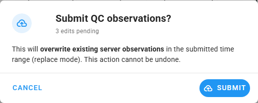

Once you confirm:

1. The app POSTs the cleaned observations to HydroServer, which overwrites the existing observations in
   the plotted window.
2. On success, the Snackbar shows "Quality-controlled observations
   submitted" and the local history is cleared.
3. On failure, the Snackbar shows the backend's error message verbatim.
   Show that to your administrator if you need help.

## Performance and big datastreams

For datastreams with hundreds of thousands of points:

- The first **All**-range fetch takes a while (paginated at 50,000 obs
  per page). The Snackbar shows a per-stream loading indicator.
- Long-running operations run on web workers when available, so the
  UI stays responsive. If your browser doesn't support
  `SharedArrayBuffer` (or the deployment dropped the COOP/COEP
  headers), operations run inline and a particularly large edit may
  freeze the UI for a moment. The result is identical either way.
- The **Performance Calibration** dialog (stopwatch icon in the nav
  rail) shows the measured worker / inline throughput on your device
  and lets you re-benchmark on demand. If big edits feel slower than
  they used to (e.g. after you upgraded your OS), re-benchmark.

See [PERFORMANCE.md](./PERFORMANCE.md) for the envelope details.

## Common tasks

### "I just want to drop everything above 1000 and re-submit."

1. Pick a workspace, then pick the datastream you want to QC.
2. Plot it (it becomes the QC target).
3. Click **All** in the Time range so you load the full series.
4. Click the pencil icon → expand **Value thresholds**, set
   `Greater than: 1000`, press Enter.
5. Expand **Delete points**, click Delete.
6. Click **Save** (or **Save & Close**), then confirm in the dialog.

### "I want to drift-correct a known-bad interval."

1. Plot the datastream. Zoom in to the bad interval on the chart.
2. Drag a box select around the interval. You need at least two
   consecutive points.
3. Open the Edit drawer → **Drift correction** → set the drift amount
   (the offset to apply linearly from start to end of the selection)
   → click **Apply**.
4. Inspect the result on the chart. Use the undo button in Edit
   history if it's wrong.
5. Click **Save** when satisfied.

### "I want to replay last week's QC on this week's data."

1. Load the new week of data on the same datastream.
2. Open the Edit history header → click the tray-arrow-up icon →
   pick last week's JSON.
3. The script's authored window may differ from this week's; the app
   will fetch the script's window. To re-apply against the new window
   instead, save the new window first, edit the script's `window`
   field in a text editor, then re-import.
4. Review the history. Click **Save**.

### "I picked the wrong workspace."

Click the grid icon in the nav rail → pick another. If you have
unsaved edits, the app asks first.

## Troubleshooting

| Symptom | Likely cause | Fix |
|---------|--------------|-----|
| Blank page on load | Wrong API URL or `localhost` vs `127.0.0.1` mismatch. | See [DEPLOYMENT.md](./DEPLOYMENT.md). |
| Plot stays empty after picking a datastream | Time range falls outside the datastream's observations. The plotted row shows a database-off icon and the subtitle reads `0 pts loaded`. | Click **All** in Time range. |
| Pencil ("Edit") icon is greyed out | No QC datastream selected. | Plot at least one datastream; the first becomes the QC target. |
| Big edits freeze the page | `SharedArrayBuffer` not available; running inline. | Have your admin re-enable COOP/COEP headers, or accept the slower fallback. |
| Save fails with a backend error | Permissions / workspace issue / network. | The Snackbar shows the backend message verbatim; share that with your admin. |
| The history shows a red failed entry after Load | The script referenced something missing in this datastream. | The rest of the script still ran; click the chevron on the row to see its arguments. |

## See also

- [README](../README.md)
- [ARCHITECTURE.md](./ARCHITECTURE.md): what's running behind the screen
- HydroServer documentation: <https://hydroserver2.github.io/hydroserver/>
