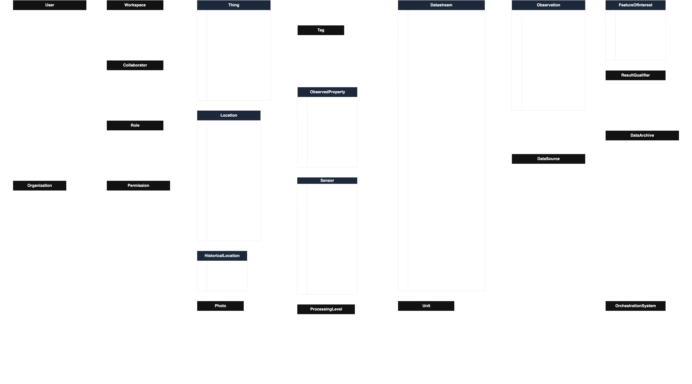
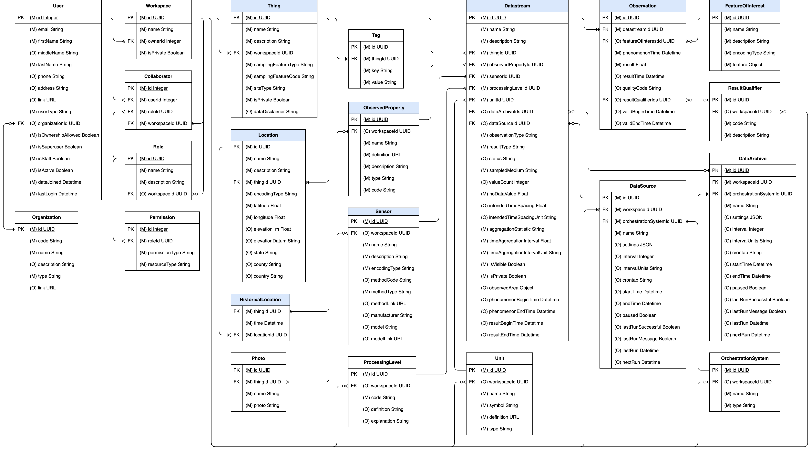

# HydroServer Data Model

HydroServer operates on top of a relational database that stores time series data using [PostgreSQL](https://www.postgresql.org/). For very large database instances, PostgreSQL's [TimescaleDB extension](https://github.com/timescale/timescaledb) can be used to enhance performance, but is not required. Here we document the relational data model used by the HydroServer software for storing time series data.

The following is an entity relationship diagram illustrating the HydroServer data model design. Primary and foreign keys are specified in the first column of each entity. Mandatory attributes are specified with "(M)" preceding the attribute name. Optional attributes are specified with "(O)" preceding the attribute name. Data types are specified following the attribute name. Given that some attributes were either derived from or mapped to attributes that appear in the Observations Data Model (ODM2, see background section below), the third column shows the the mapping of attributes in HydroServer's data model to ODM attributes. Entities shown with blue title bars are part of the SensorThings API data model (see below). Entities with white title bars were added to the SensorThings data model to accomodate functionality required for the HydroServer software.

Click [here](data-dictionary.md) to access a data dictionary for the HydroServer data model.

## Background on HydroServer's Data Model Design

The HydroServer software is based on the Open Geospatial Consortium's [SensorThings](https://www.ogc.org/publications/standard/sensorthings/) Application Programming Interface (API) and data model standard specification. In particular, HydroServer implements [OGC SensorThings API Part 1: Sensing Version 1.1](https://docs.ogc.org/is/18-088/18-088.html) and adopts the data model used by SensorThings. The following UML diagram illustrates the entities used by SensorThings to represent sensor data.

Given that SensorThings is an API standard specification, SensorThings' data model is expressed as UML since it has multiple physical implementations - e.g., as a JSON schema for encoding data for transfer over the Internet and as a database data model for storing data. The SensorThings standard document does not specify how data should be stored on disk for delivery via the API. This is left to the implementers of the API.

SensorThings is a generic Internet of Things (IoT) API. It has been implemented for environmental monitoring, building information systems, and many other sensing applications where IoT sensors and devices are employed. As such, it is a generic standard that must work for any IoT device. The following is a brief description of each SensorThings entity adapted from the text of the OGC standard document:

- **Thing**: A thing is an object of the physical world (physical things) or the information world (virtual things) that is capable of being identified and integrated into communication networks. In the context of environmental monitoring, a Thing is a monitoring station (e.g., a streamflow gage, water quality station, diversion measurement location, etc.).
- **Location**: The Location entity locates the Thing. A Thing’s Location entity is defined as the last known location of the Thing.
- **HistoricalLocation**: A Thing’s HistoricalLocation entity set provides the times of the current (i.e., last known) and previous locations of the Thing.
- **Sensor**: A Sensor is an instrument that observes a property or phenomenon with the goal of producing an estimate of the value of the property.
- **ObservedProperty**: An ObservedProperty specifies the phenomenon of an Observation (e.g., flow, temperature, pH, dissolved oxygen concentration, etc.).
- **DataStream**: A Datastream groups a collection of Observations measuring the same ObservedProperty and produced by the same Sensor. This is a time series of observations.
- **Observation**: An Observation is the act of measuring or otherwise determining the value of a property, including its numeric result and the date/time at which it was observed.
- **FeatureOfInterest**: An Observation results in a value being assigned to a phenomenon. The phenomenon is a property of a feature, the latter being the FeatureOfInterest of the Observation. In the context of the Internet of Things, many Observations’ FeatureOfInterest can be the Location of the Thing. In the context of environmental monitoring, the FeatureOfInteres may be a real-world feature such as a stream reach, watershed, aquifer, etc.

The level of generality in the SensorThings data model means that it lacks specific information needed for unambiguous interpretation of environmental sensor data. However, the SensorThings data model provides a mechanism for extending entities to include additional required and optional attributes. Each entity includes a `properties` or `parameters` attribute that can be extended to contain additional attributes. Thus, to enhance SensorThings utility for use with environmental sensor data while keeping its standardized API capability, HydroServer extends the SensorThings data model using this extensibility mechanism while adding additional required and optional metadata attributes from Version 2.0 of the Observations Data Model (ODM2).

Horsburgh, J. S., Aufdenkampe, A. K., Mayorga, E., Lehnert, K. A., Hsu, L., Song, L., Spackman Jones, A., Damiano, S. G., Tarboton, D. G., Valentine, D., Zaslavsky, I., Whitenack, T. (2016). Observations Data Model 2: A community information model for spatially discrete Earth observations, Environmental Modelling & Software, 79, 55-74, [https://doi.org/10.1016/j.envsoft.2016.01.010](https://doi.org/10.1016/j.envsoft.2016.01.010)

ODM2 was designed for storing and integrating a broad variety of feature-based earth observations. However, for the purpose of HydroServer, only ODM2's representation of fixed point-based time series data was used (i.e., time series of observations from fixed location monitoring sites). For illustration purposes, a UML diagram of the ODM2 information model for time series data derived from the overall ODM2 information model is included below. The ODM2 data model for time series data was blended with the SensorThings data model to produce HydroServer's data model.

